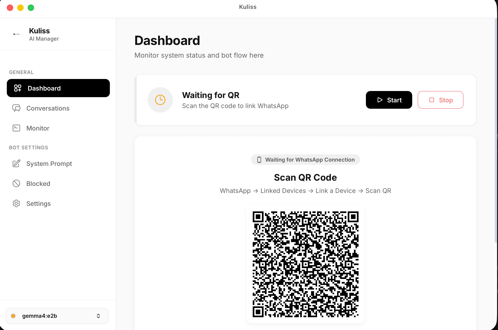

# Kuliss AI — WhatsApp AI Manager

An experimental, lightweight local AI WhatsApp bot written in Go. I originally built this for my own SaaS project to connect Ollama directly to WhatsApp via a simple and user-friendly desktop interface. While it can serve as a virtual assistant for beauty salons, spas, clinics (introducing services, answering queries, booking leads), its flexible architecture allows it to be adapted for a wide variety of local AI use cases.

⚠️ CRITICAL DISCLAIMER: WhatsApp Ban Risk
This application utilizes whatsmeow, an unofficial Go library, to communicate with the WhatsApp Web API. Because this is not an official Meta/WhatsApp Business API product, using it for commercial purposes carries a inherent risk of getting your WhatsApp account banned. Please use it responsibly, do not spam, and understand the risks before using it in a production environment.

🛠️ Tech Stack & Architecture
This application is built as a high-performance desktop software using modern web and systems technologies:

Wails v3: The core framework to bundle our Go backend and web frontend into a lightweight desktop app.
Go (Golang): Used for performance-critical backend logic, WhatsApp connection, and system processes.
whatsmeow: Go library to interact with WhatsApp.
Ollama: For running open-source Large Language Models (LLMs) entirely offline securely and fast.
SQLite: Natively ships with standard SQLite for a truly zero-dependency local application experience, storing all conversations and states locally inside the Wails app. (Docker & PostgreSQL are optionally supported for heavy deployment models).
Node.js / npm: Used to manage and build the JavaScript/CSS frontend assets.
🚀 Getting Started
To get the project up and running locally, you'll need the following tools installed on your machine.

Prerequisites
Go (Golang): Go version 1.22+ is required.
Mac (Homebrew): brew install go
Please make sure the Go environment is correctly configured in your PATH.
Node.js & npm: Required to build the frontend assets.
Mac (Homebrew): brew install node
Ollama: Essential for running the AI locally.
curl -fsSL https://ollama.com/install.sh | sh
Wails v3 CLI: The tool required to run and build the Wails desktop application.
go install github.com/wailsapp/wails/v3/cmd/wails3@latest
New to Wails? If you later want to create a brand new Wails v3 application from scratch, the command looks like this:

# This creates a new project named myapp with a vanilla JavaScript frontend
wails3 init -n myapp -t vanilla
cd myapp && wails3 dev
💻 Installation & Setup
Follow these steps to set up the Kuliss development environment:

1. Clone the Project
git clone https://github.com/efeberkceker/kuliss-ai.git
cd kuliss-ai
2. Start PostgreSQL via Docker
This project stores all WhatsApp message histories and active bot sessions inside a PostgreSQL instance. Use Docker to boot it up easily:

# This uses the docker-compose.yml file to start the database in the background
docker compose up -d
3. Run the App using Wails
Start the development server. This command will simultaneously build the frontend, compile the Go backend, and launch the Kuliss AI window. Any changes to the code will trigger an auto-reload.

wails3 dev
Note: If your frontend requires separate installation first, navigate to the frontend folder and run npm install.

⚙️ Usage Breakdown & Customization
Connecting WhatsApp
Launch the application using wails3 dev.
On the Dashboard, you will see a QR Code.
Open WhatsApp on your phone -> Go to Linked Devices -> Link a Device -> Scan the QR Code.
Your bot is now actively listening for incoming messages!
Customizing the bot (prompt.txt)
The personality and knowledge base of the Kuliss assistant is governed by prompt.txt. You can modify this file to dictate how the AI should introduce your business, what prices to quote, and what services to offer. No recompiling of Go code is required!

💡 PRO TIP for Performance: The more detailed and exact your prompt.txt is (specifically by providing ready-to-use Q&A examples), the faster the AI will generate responses. When the local AI model (Ollama) has pre-defined formats and precise answers to follow, it spends drastically less time interpreting instructions (reducing inference latency), allowing for incredibly fast, near-instant replies to your customers!

Switching the AI Model (.env or UI)
You have two robust ways to switch your intelligent AI models:

Dynamically via UI: Navigate to the Settings page directly within the Kuliss desktop interface and change your Ollama model from the dropdown.
Via Environment file: Alternatively, tweak the exact LLM weights via your environment files.
# Default suggested model:
OLLAMA_MODEL=gemma4:e4b
🌐 External REST API
Kuliss exposes a RESTful API (default port :8080) so your other internal software can trigger messages on demand:

# Example: Send an outbound message programmatically
curl -X POST http://localhost:8080/send \
  -H "Content-Type: application/json" \
  -d '{"phone": "905XXXXXXXXX", "message": "Hi, your appointment is confirmed!"}'
📦 Production Deployment
When you're ready to deploy Kuliss AI for actual usage, follow these steps to secure and build your production bundle.

1. Configure Production Database
The docker-compose.yml provided is production-ready. It includes automatic restarts, health checks, and references an environment file to keep secrets secure.

Create a .env file in the root directory (do not commit this):
DB_USER=postgres
DB_PASSWORD=your_secure_password
DB_NAME=kuliss_db
OLLAMA_MODEL=gemma4:e4b
Start the production database in the background:
docker compose up -d
2. Build the Application Binary
Do not use wails3 dev in production. Instead, compile the application into a standalone binary/executable using the Wails build command. This will optimize your frontend assets and compile Go without debug flags.

# Build for your current operating system (Mac/Windows/Linux)
wails3 task build
Once completed, your production-ready executable will be located in the bin/ folder. Simply run this executable alongside your running Docker background services, and Kuliss will perform optimally.

3. Packaging for macOS (DMG)
If you are on macOS and want to create a distributable .dmg file, you can use the built-in task runner:

# This will sign, notarize and create a DMG file.
wails3 task darwin:release
The final notarized .dmg will be generated inside the bin/ folder.

🤝 Contributing
Feel free to open an issue or submit a pull request! Features, UI improvements, and bug fixes are highly appreciated.

📄 License
This project is licensed under the MIT License — Use, distribute, and modify it freely.

kuliss.com